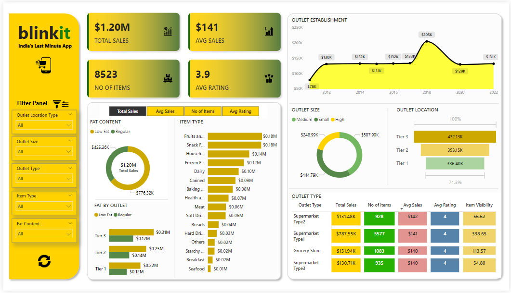

# Blinkit_PowerBI_Dashboard
## Project Overview  

This Power BI project provides a comprehensive analysis of Blinkit's sales performance, customer satisfaction, and inventory distribution. The dashboard leverages various Key Performance Indicators (KPIs) and visualizations to uncover actionable insights, identify trends, and optimize business strategies.

## Project Steps:
- Requirement Gathering / Business Requirements
- Data Walkthrough
- Data Connection
- Data Cleaning / Quality Check
- Data Modeling
- Data Processing
- DAX Calculations
- Dashboard Layouting
- Charts Development and Formatting
- Dashboard / Report Development
- Insights Generation

## Business Requirements:
The objective of this project is to analyze Blinkit's sales performance, customer satisfaction, and inventory distribution. 

### The analysis focuses on the following KPIs and visualizations:

#### KPI Requirements:
- Total Sales
- Average Sales
- Number of Items
- Average Rating
  
#### Chart Requirements:
- Total Sales by Fat Content
- Total Sales by Item Type
- Fat Content by Outlet for Total Sales
- Total Sales by Outlet Establishment
- Sales by Outlet Size
- Sales by Outlet Location
- All Metrics by Outlet Type

## Key Insights  

- Total Sales: $1.20M
- Average Sales: $141
- Number of Items: 8,523
- Average Rating: 3.9
  
#### 1. Sales Performance Trends
- Peak Sales: Highest total sales of $205k occurred in 2018, indicating a strong performance year.
- Lowest Sales: The lowest sales of $78k were observed in 2011, suggesting potential market challenges during that period.

#### 2. Outlet Size Impact  
- Medium-Sized Outlets: Achieved the highest total sales of $507.90k, indicating they are optimal for revenue generation.
- Large Outlets: Reported the lowest total sales of $248.99k, suggesting potential inefficiencies or underperformance.

#### 3. Outlet Location Analysis  
- Tier 3 Locations: Generated the highest total sales of $472.13k, reflecting a strong market presence and potentially favorable conditions.
- Tier 1 Locations: Had the lowest total sales of $336.40k, indicating possible market challenges or less effective strategies.

#### 4. Outlet Type Performance  
- Supermarket Type 1: Recorded the highest total sales of $787.55k, indicating strong performance and high item visibility.
- Supermarket Type 3: Achieved the lowest total sales of $130.71k, which might reflect issues with visibility or market positioning.  
#### 5. Sales by Fat Content  
- Low Fat Content: Contributed 64.6% of total sales, demonstrating a strong consumer preference for low-fat products.
- Regular Fat Content: Made up the remaining percentage of sales, showing it still holds a significant market share.
#### 6. Sales by Item Type  
- Top Performer: Fruits and Vegetables had the highest total sales of $178,124.08, indicating high consumer demand.
- Lowest Sales: Seafood had the lowest total sales of $9,077.87, suggesting it is less popular or has lower turnover.
#### 7. Sales by Outlet Location and Fat Content  
- Tier 3: Excelled in both low-fat and regular-fat food sales, showing strong performance across both categories.
- Tier 1: Struggled with lower sales in both low-fat food ($215,047.91) and regular fat food ($121,349.90), indicating potential market weaknesses.
#### 8. Average Sales and Ratings  
- Average Sales: Consistent across fat content categories, ranging from $140 to $143.
- Item Type: Household items have the highest average sales at $149, while baking goods have the lowest at $126.
- Ratings: Consistently high at 4, reflecting general customer satisfaction.
#### 9. Number of Items  
- Low Fat Content: Represents a larger inventory with 6,000 items, reflecting high demand and variety.
- Regular Fat Content: Includes 3,000 items, indicating a smaller but still significant segment.
- Item Type: Fruits and Vegetables have the highest number of items (1,232), while Seafood has the lowest (64).
#### 10. Outlet Location Details  
- Tier 1: Includes Supermarket Type 1 and grocery stores, with the highest sales in 2012 ($130k) and the lowest in 2018 ($74k).
- Tier 2: Features Supermarket Type 1 with all outlet sizes; highest sales in 2017 ($393.15k) and lowest in 2020.
- Tier 3: Includes all outlet types and sizes; highest sales in 2014 ($472.13k) and lowest in 2011.
#### 11. Fat Content Analysis  
- Low Fat Content: Total sales of $776.32k with 5,517 items, indicating strong market demand.
- Regular Fat Content: Total sales of $425.36k with 3,006 items, showing it remains an important product segment.

## Visualizations
#### The dashboard includes the following visualizations:

Total Sales by Fat Content: Donut Chart  
Total Sales by Item Type: Bar Chart  
Fat Content by Outlet for Total Sales: Stacked Column Chart  
Total Sales by Outlet Establishment: Line Chart  
Sales by Outlet Size: Donut Chart  
Sales by Outlet Location: Funnel Map  
All Metrics by Outlet Type: Matrix Card  

## Interactive Features
Slicers: Enable detailed analysis by outlet size, outlet type, and item type even more.

## Dashboard Overview

You can download and view the project demonstration video by [clicking here](Blinkit_clip.1.mp4)

## Conclusion
The analysis highlights the importance of outlet size, location, and product type in driving sales. Medium-sized outlets and Tier 3 locations are particularly effective at generating revenue. Low-fat products are preferred, and certain item types, like Fruits and Vegetables are preffered more. These insights can guide strategies for optimizing sales performance, inventory management, and market positioning.

